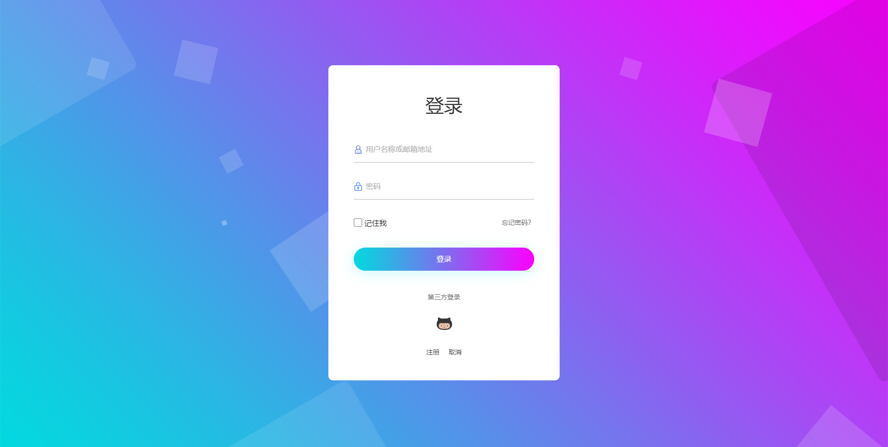

# J3space.Abp.Extensions

[WIP] abp vnext 框架的补充

## 说明

abp vnext 框架是 C# 平台优秀的开源项目，其模块化的设计，基于 DDD 的清晰的项目结构十分适合二次开发。

但是在 startup 项目中仍然有一些不足的地方。

1. 有些项目只在商业版本中可用，例如 Identity Server 模块对客户端，Api 资源的管理等。
2. 默认基于 Bootstrap 和 jQuery 的用户界面，官方提供的替换页面的方法远不如自行设计来的方便。

为此，本项目主要是基于自己开发过程中的需求，添加一些模块，或者替换原生的一些模块。

- [x] Identity Server
  - [x] 客户端资源管理接口(添加)
  - [x] Api 资源管理接口(添加)
  - [x] 身份资源管理接口(添加)
  - [x] 权限管理(添加)
  - [x] Consent 页面(重写)
- [x] Account
  - [x] 基于 [Bulma](https://bulma.io/) 轻量 css 框架的全新界面(重写)
  - [x] 忘记密码/重置密码功能(官方已添加)
  - [x] 外部身份认证(官方已添加)
- [x] Setting Management
  - [x] 查看，更改，重置接口(添加)
  - [x] 权限管理(添加)

## 测试

以下内容建立在你已经了解 [Abp vnext](https://docs.abp.io/en/abp/latest) 的基础上。

1. 建立数据库，SampleApp 使用的是 MongoDB
2. 克隆本仓库，在 appsettings.json 中配置 GitHub 的 ClientId 以及 Client Secret
3. 运行 demo 目录下的 J3space.Sample.HttpApi.Host 项目，此时可查看用户相关功能及 Swagger 页面
4. 克隆 [CodeLearner](https://github.com/taujiong/CodeLearner) 仓库
5. 配置 IdentityServer 目录下的 Data.Shared 项目中的 IdsConstants 类，设置相应参数
6. 依次运行 IdentityServer 目录下的 Api1、ConsoleClient、WpfClient、MvcClient 项目
